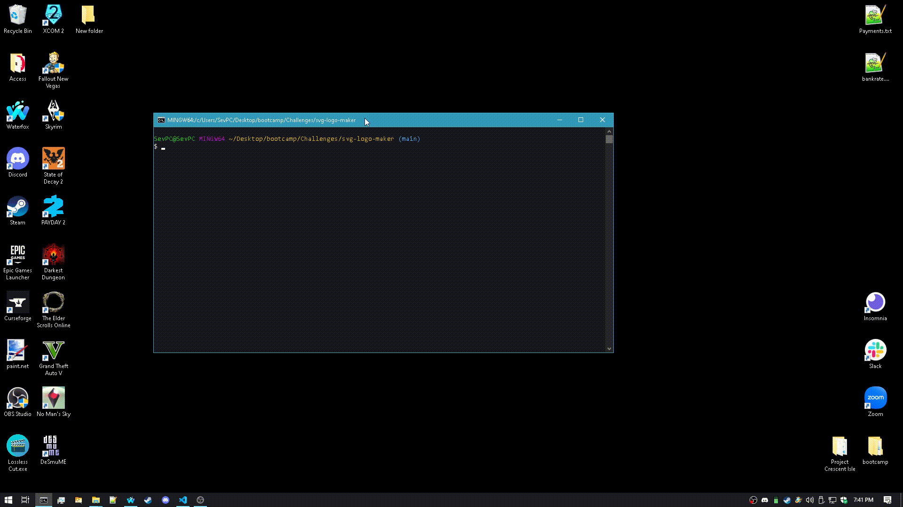

# nodejs-readme-generator

## Table of Contents

- [Description](#Description)
- [Installation](#Installation)
- [Usage](#Usage)
- [Test Instructions](#Test_Instructions)
- [License](#License)
- [Questions?](#Questions?)

## Description

My very own hedonistic logo generator. Made using the criteria from Module 10 of my edX Web Development bootcamp. I made it as compact as possible within my tight time limit I had.

## Installation

Simply download the full repository and all of it's contents, then run the index file (ideally inside it's own folder) with an installed instance of Node via the command "node index.js".

## Usage

From either Git Bash or a command window, from the directory that the index.js file is downloaded and located inside, install Node via command "npm i", then run the command "node index.js" to run the logo generator.

## Demonstration

## Test Instructions

Run the command "npm test".

## License

This project is protected under the MIT License.

## Questions?

Reach out to me either on [GitHub](https://github.com/NoahJRalph) or by [Email](mailto:NoahJRalph@gmail.com).
